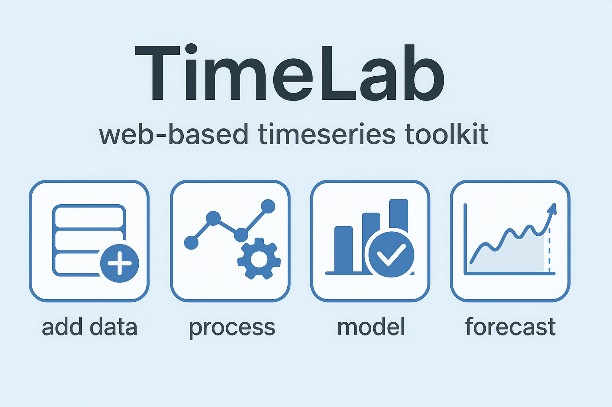

# TimeLab



**TimeLab** is a modern, web-based time series forecasting and analysis platform that provides an intuitive interface for time series data analysis, model training, and forecasting.

## About

```
████████╗██╗███╗   ███╗███████╗██╗      █████╗ ██████╗ 
╚══██╔══╝██║████╗ ████║██╔════╝██║     ██╔══██╗██╔══██╗
   ██║   ██║██╔████╔██║█████╗  ██║     ███████║██████╔╝
   ██║   ██║██║╚██╔╝██║██╔══╝  ██║     ██╔══██║██╔══██╗
   ██║   ██║██║ ╚═╝ ██║███████╗███████╗██║  ██║██████╔╝
   ╚═╝   ╚═╝╚═╝     ╚═╝╚══════╝╚══════╝╚═╝  ╚═╝╚═════╝ 
```

This project is developed and maintained by **Shahab Afshar**.

**Professor:** [Dr. Farzad Sabzikar](https://faculty.sites.iastate.edu/sabzikar)  
**Department:** Electrical and Computer Engineering (ECPE)  
**University:** Iowa State University

---

## Features

TimeLab provides a comprehensive workflow for time series analysis:

### 📊 **Add Data**
- Upload CSV, Excel, or text files
- Automatic column detection and data validation
- Sample datasets for quick start
- Dataset management with search and delete

### ⚙️ **Process**
- Time series transformation and preprocessing
- Stationarity testing with multiple transformation methods
- ACF/PACF analysis for parameter estimation
- Seasonal decomposition (trend, seasonal, residual)

### 🤖 **Model**
- SARIMAX model training with automatic parameter optimization
- Grid search for hyperparameter tuning
- Model evaluation metrics (RMSE, MAE, MAPE, AIC, BIC, HQIC)
- Model persistence and management

### 📈 **Forecast**
- Generate forecasts with confidence intervals
- Interactive visualization with zoom and pan
- Historical data comparison
- Export analysis code

---

## Quick Start

### ⚡ Easiest Way - Just Double Click!

**Windows:**

**Backend:**
- Double-click `run-backend.bat`
- Or run `.\run-backend.ps1` (PowerShell)

**Frontend:**
- Double-click `run-frontend.bat`
- Or run `.\run-frontend.ps1` (PowerShell)

**Access:**
- Frontend: http://localhost:3000
- Backend API: http://localhost:8000
- API Docs: http://localhost:8000/docs

> 💡 **Tip:** Uses SQLite by default (no database setup needed!)

### Port Already in Use?

If port 8000 is busy, use alternative port:
```powershell
.\backend\run-backend-port.ps1
# Or specify custom port:
.\backend\run-backend-port.ps1 -Port 9000
```

Kill process using port 8000:
```powershell
.\backend\kill-port.ps1
```

### Option 2: Docker (Production-like)

**Windows:**
```powershell
.\start.ps1
```

**Linux/Mac:**
```bash
chmod +x start.sh && ./start.sh
```

---

## Quick Test

**Windows:**
```powershell
.\test-api.ps1
```

**Linux/Mac:**
```bash
chmod +x test-api.sh && ./test-api.sh
```

---

## Prerequisites

- **Python** 3.9+ (for backend)
- **Node.js** 18+ and npm (for frontend)
- **Docker** (optional, for containerized deployment)
- **Git** (for cloning the repository)

---

## Installation

### Clone the Repository

```bash
git clone https://github.com/shahabafshar/TimeLab.git
cd TimeLab
```

### Local Development Setup

**Backend:**
```bash
cd backend
python -m venv venv
source venv/bin/activate  # Windows: venv\Scripts\activate
pip install -r requirements.txt
```

**Frontend:**
```bash
cd frontend
npm install
```

### Docker Setup

```bash
docker-compose up -d
docker-compose exec backend alembic upgrade head
```

---

## Usage

### Using the Application

1. **Upload Dataset**: Go to the home page and upload your time series data (CSV, Excel, or TXT)
2. **Create Project**: Select a dataset and create a new analysis project
3. **Configure Analysis**: Set date column, target column, and frequency
4. **Run Analysis**: Follow the guided workflow:
   - Test stationarity
   - Calculate ACF/PACF
   - Train SARIMAX model
   - Generate forecasts
5. **View Results**: Explore interactive visualizations and export your analysis

### Using Sample Datasets

TimeLab includes 8 well-known sample datasets perfect for learning:
- Air Passengers
- CO2 Levels
- Sunspots
- Retail Sales
- Temperature
- Stock Prices (AAPL)
- Electricity Consumption
- GDP Growth

---

## Project Structure

```
TimeLab/
├── frontend/              # Next.js React frontend
│   ├── app/              # App router pages
│   ├── src/
│   │   ├── components/   # React components
│   │   ├── lib/          # Utilities and API client
│   │   └── types/        # TypeScript types
│   └── package.json
├── backend/               # FastAPI Python backend
│   ├── app/
│   │   ├── api/          # API endpoints
│   │   ├── models/       # Database models
│   │   ├── schemas/      # Pydantic schemas
│   │   ├── services/     # Business logic
│   │   └── core/         # Core configuration
│   ├── alembic/          # Database migrations
│   ├── data/             # Sample datasets
│   └── requirements.txt
├── docs/                  # Documentation
│   └── arauto/           # Arauto analysis docs
├── docker-compose.yml     # Docker services
├── start.ps1             # Docker startup (Windows)
├── start.sh              # Docker startup (Linux/Mac)
├── run-backend.bat       # Backend startup (Windows)
├── run-frontend.bat      # Frontend startup (Windows)
└── README.md
```

---

## API Documentation

Once the backend is running:
- **Swagger UI**: http://localhost:8000/docs
- **ReDoc**: http://localhost:8000/redoc
- **Health Check**: http://localhost:8000/health

---

## Docker Services

- **PostgreSQL** (TimescaleDB): Port 5432
- **Redis**: Port 6379
- **Backend** (FastAPI): Port 8000
- **Frontend** (Next.js): Port 3000
- **Celery Worker**: Background tasks

---

## Development

### Local Development (No Docker)

**Backend:**
```bash
cd backend
source venv/bin/activate  # Windows: venv\Scripts\activate
uvicorn app.main:app --reload
```

**Frontend:**
```bash
cd frontend
npm run dev
```

### Database Migrations

```bash
cd backend
alembic upgrade head
```

---

## Documentation

- `RUN_LOCAL.md` - Local development guide (no Docker)
- `QUICK_RUN.md` - Quick run instructions
- `docs/arauto/` - Arauto analysis and planning documentation

---

## What's Different from Arauto?

TimeLab is a complete modernization of the Arauto project:

- ✅ **Modern RESTful API** architecture (FastAPI)
- ✅ **Database persistence** (projects, models, datasets)
- ✅ **Async task processing** (Celery)
- ✅ **Modern React UI** (vs Streamlit)
- ✅ **Production-ready structure**
- ✅ **Docker deployment**
- ✅ **All Arauto algorithms preserved** and adapted
- ✅ **Interactive visualizations** with zoom and pan
- ✅ **Project management** workspace
- ✅ **Sample datasets** for quick start

---

## Stop Services

**Docker:**
```bash
docker-compose down
```

**Local:** Press `Ctrl+C` in each terminal

**Kill port:**
```powershell
.\backend\kill-port.ps1
```

---

## Notes

- **Docker mode**: First run takes a few minutes to build images
- **Local mode**: Uses SQLite by default (no database setup!)
- Database migrations run automatically
- Frontend hot-reloads on code changes
- Backend auto-reloads on code changes

---

## License

MIT License

---

## Acknowledgments

Special thanks to:
- **Dr. Farzad Sabzikar** - Professor, Electrical and Computer Engineering, [Iowa State University](https://faculty.sites.iastate.edu/sabzikar)
- The **Arauto** project team for the original time series analysis algorithms

---

## Contributing

Contributions are welcome! Please feel free to submit a Pull Request.

---

## Contact

For questions or issues, please open an issue on GitHub.
